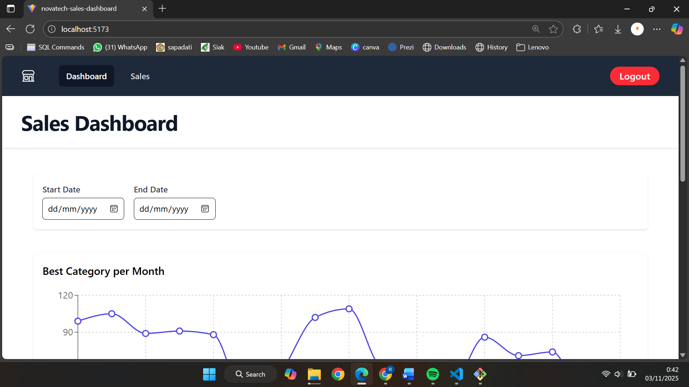
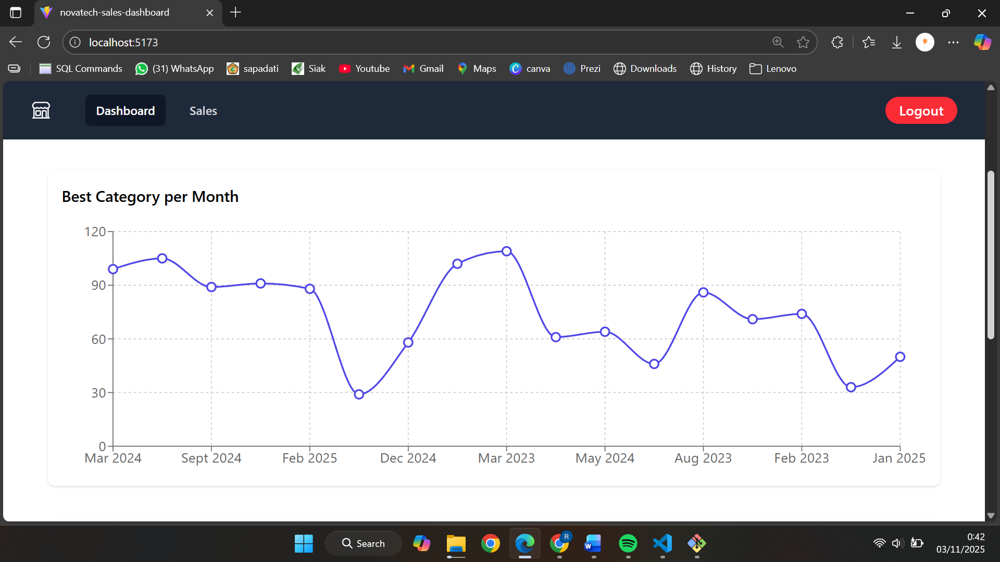
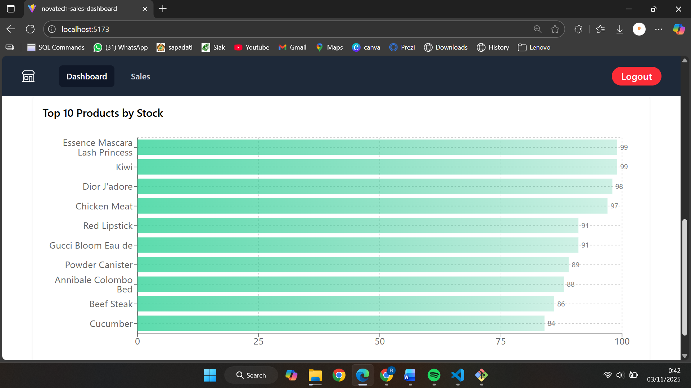
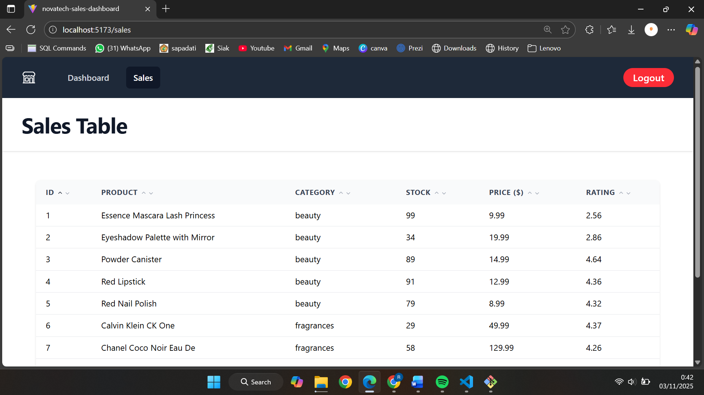
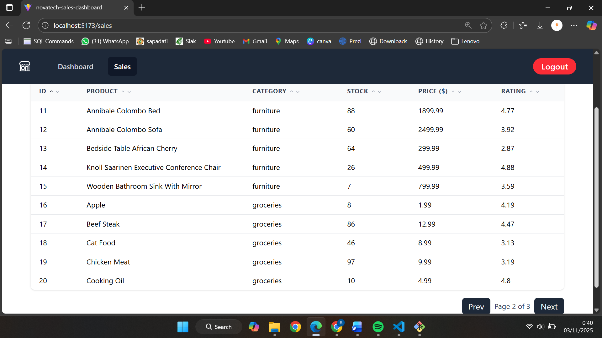
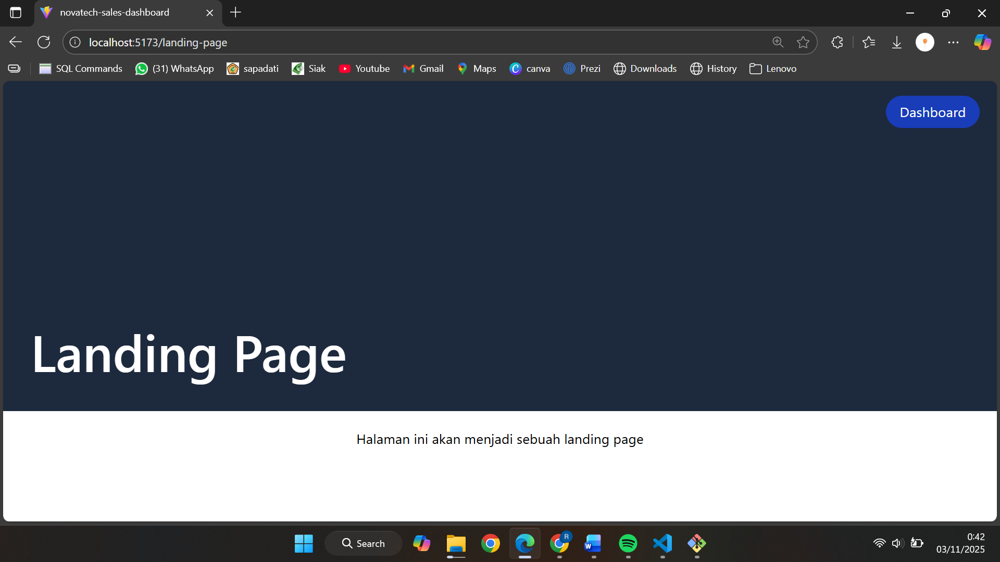

# Novatech Sales Dashboard

Proyek ini merupakan dashboard analitik penjualan sederhana yang menampilkan data sales dalam bentuk chart dan tabel.  
Aplikasi ini dibuat menggunakan React JS + Vite dan Tailwind CSS untuk styling, serta Recharts untuk visualisasi data.

Sales Dashboard ini menampilkan:
- Filter tanggal untuk filter data penjualan.
- Line Chart yang menampilkan kategori terbaik tiap bulan.
- Bar Chart yang menampilkan 10 produk teratas berdasarkan stok.
- Table Sales dengan fitur sorting dan pagination.

Seluruh data diambil dari API eksternal dummy agar simulasi menyerupai data real.

---

## Library 
 - React JS (Vite) 
 - Tailwind CSS
 - Axios
 - React Router DOM
 - Recharts
 - Heroicons
 - Headless UI
 
---

## Langkah Instalasi & Menjalankan Project
- Clone repository
```bash
 git clone https://github.com/RahmiAulia/novatech-sales-dashboard.git
 cd novatech-sales-dashboard
```
- Install depedencies
 ```bash
 npm install
```
- Jalankan project
 ```bash
 npm run dev
 ```

---

## Screenshot Tampilan Akhir
- dashboard chart



- Sales Table 


- Landing Page



